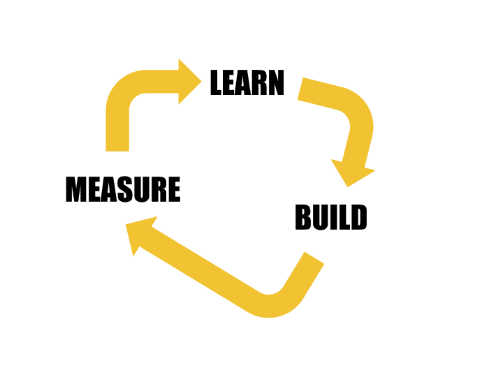

# Developer Relations at MeiliSearch
We will slowly add all our processes in this repo. This is how we roll at MeiliSearch, open source to the core! You can also have an idea of what the developer relations team is working on by checking the [devrel issues](https://github.com/meilisearch/devrel/issues) (for devrel tasks only).

## Table of Contents
- [New MeiliSearch Release](processes/releases.md)

## Our Mission
We help developers be successful by nurturing a healthy and open-source community around MeiliSearch. This means listening to, inspiring, educating, and supporting our community however we can.

## The 3Cs
The three pillars of Developer Relations are **C**ommunity, **C**ontent, and **C**ode, also known as the 3Cs*. The main focus of our team is the community: just read our mission to understand that everything we do is for our community. To help us achieve our mission, we use two main activities: content and code. The former is any type of content on any useful medium; some examples are talks at conferences, documentation, or video tutorials. The latter, code, is part of the foundation of who we are: we are developers. It translates into code examples for the documentation, code demos for our conference presentations, technical support, or even being responsible for specific APIs or contributing to open source to give back to the community and be a good web citizen. All together, they form the foundation of developer relations.

\* *adapted from [SendGrid 2014 article](https://sendgrid.com/blog/3-cs-developer-relations/)*

## Lean Approach
We believe that plans should never be set in stone: they are a lighthouse guiding us in the right direction. We make plans to ensure that we are focusing in the right direction and maximizing our efforts where we can have the greatest impact.

Our process will always be “[lean startup](http://theleanstartup.com/principles)” style.

We will update our yearly planning and tasks based on the KPI we will gather while working on them. If we are not successful, even with all the focus work done, we will take the time to evaluate our processes. We can go as far as modifying the yearly goal to adapt to how our industry and community is responding to our efforts.

## Activities
Here is an exhaustive list of developer relations activity categories. We are taking activities that could be managed by a marketing or social media team for now.

### Blog Management
- Writing blog posts for MeiliSearch or as a guest elsewhere
- Managing external writers, whether volunteers or paid freelancers

### Code Contributions Managemeny
- Helping contributors and reviewing code-related PRs

### Documentation Management
- Helping contributors and reviewing documentation-related PRs
- Writing documentation
- Resolving documentation-related issues and maintaining the repository

### Learning Resource Creation
- Creating demo applications using MeiliSearch
- Creating helpful code snippets
- Creating example datasets

### Technical Support / Customer Service:
- Discourse Support
- Slack Support

### Hackathon
- Running hackathon contests and mentoring participants

### Newsletter
- Writing and sending the newsletter

### Podcast
- Participating in external audio podcasts or running the official MeiliSearch podcast, if we create one

### Public Speaking
- Speaking at conferences, including creating slides & demos
- Organizing and speaking at meetups, including creating slides & demos

### Slack Community Management
- Ensuring a healthy and active Slack community

### Social Media Management
- Posting, commenting, and replying on social media accounts

### Tech Media Spokesperson
- Speaking to tech media on behalf of the company

### Video Production
- Participating in or creating our own vidcasts, live streams, and other video-based content (such as tutorials)

### Virtual Evangelist Management
- Managing a digital volunteer program (equivalent to Microsoft MVP, Google Experts, etc....)
