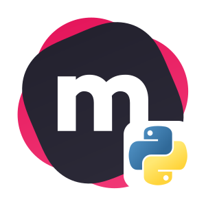
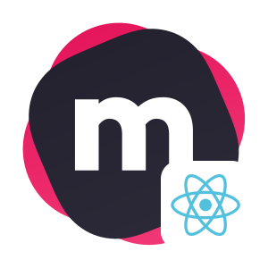
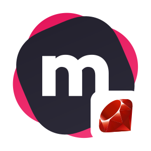
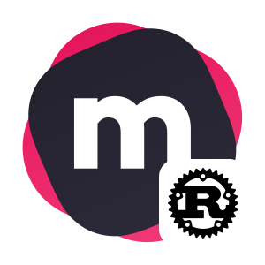
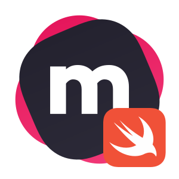
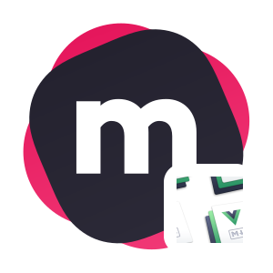
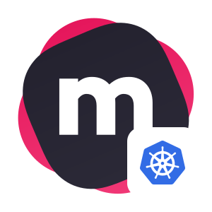

# MeiliSearch Information & Assets

## Table of Contents
- [Product Description](#product-description)
- [Logos](#logos)
  - [MeiliSearch Logos](#meilisearch)
  - [Software Developement Kits (SDKs)](#software-developement-kits-sdks)
  - [Framework Logos](#frameworks)
  - [Integrations Logos](#integrations)
  - [Cloud Logos](#cloud)

## Product Description

### Short
MeiliSearch is an open source, blazingly fast and hyper relevant search-engine.

### Long
MeiliSearch is a powerful, fast, open-source, easy to use and deploy search engine. Both searching and indexing are highly customizable. Features such as typo-tolerance, filters, and synonyms are provided out-of-the-box.

### Keywords
Search Engine, Open Source, Rust, Fast

## Logos
Here a list of official logos we use in vectorial format.

### MeiliSearch

#### Logo

#### Icon

#### Signature

### Software Developement Kits (SDKs)

#### .NET

#### Dart

#### Go

#### Java

#### JavaScript

#### PHP

#### Python

#### Rails

#### React

##### Ruby

#### Rust

#### Swift

#### Vue

### Frameworks

#### Laravel Scout

#### Symfony

### Integrations

#### VuePress

#### WordPress

### Cloud

#### Amazon Web Services (AWS)

#### DigitalOcean (DO)

#### Kubernetes (K8S)

<link rel="stylesheet" type="text/css" media="all" href="styles.css" />