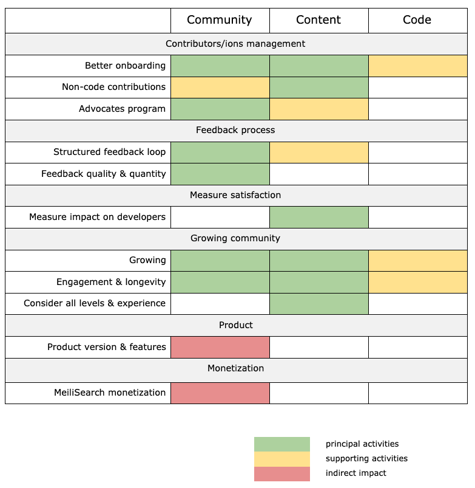

# 2021 Goals

## MeiliSearch Goals
This is a summary our MeiliSearch company goals for 2021 and how we can influence those.

### Community
This is where we can have a real & huge impact: in the end, community is basically developer relations, with the help of every other part of the business.

#### Contributor management
1. Better contributor onboarding
2. Contributions outside of just code
3. MeiliSearch advocates program (ex.: Microsoft MVP, Google Experts)

#### Feedback process
1. Structured feedback loop
2. Feedback quality & quantity

#### Measure satisfaction
1. Measuring MeiliSearch impact on developers

#### Growing community
1. Growing the community
2. Community engagement & longevity
3. Consider all levels of expertise & experience

### Product
We won’t participate in building new features or fixing issues directly on the product or integration repositories, but we can influence the roadmap with the feedback we get from being on the ground with our community members.

### Monetization
Even though increasing the size of our community increases our chances of getting paid customers, we still won’t directly impact this 2021 goal. In addition to influencing the product roadmap, we need to ensure that we don’t alienate our open-source community while communicating about monetization. This is critical!

*The 2021 MeiliSearch goals aligned with the [Developer Relations 3Cs](../#the-3cs)*

## Developer Relations 2021 OKR

Most of our 2021 goals aren’t quantifiable: we do it or don’t do it, there is no in-between. They are listed in company goals order, Developer Relations Framework first (a devrel only goal) as it is the foundation on which we can achieve the rest. MeiliSearch goals for this year are mostly oriented toward our community, hence the nearly perfect alignment with ours.

### Developer Relations Framework
- Blog posts, tutorials, talks, newsletter items, and conference sponsorship ideas tracking system
- Discourse up & running
- Documentation of manager’s expectation & style
- Documented new release process developer relations actions
- Internal documentation maintenance + style guides
- Make MeiliSearch more human
- Mechanisms to easily track progress
- Orbit app day to day integration
- Public documentation general guidelines & philosophical principles
- Sponsorship & public speaking opportunities form
- Wordpress up & running
- YouTube channel

### Better Contributors Onboarding
- Clear & public documentation issues & PR evaluation process
- Contribution information (core, integrations & tools) has more details
- Contribution information (core, integrations & tools) is integrated into the documentation

### Non-Code Contributions
- Documentation about blog post contributions
- Documentation about Discourse contributions
- Documentation about external documentation contributions
- Documentation about meetup organization contributions
- Documentation about public speaking contributions
- Documentation about Slack Community contributions
- Documentation about text-based tutorial contributions
- Documentation about video content contributions

### Advocates Program
- An advocate program framework
- The program runs with a test group of ten members

### Structured Feedback Loop
- Better internal communication processes
- Integrate better Slack questions management
- Issues templates to redirect feedback to the right medium
- Streamline & clearly define our feedback loop

### Feedback Quality & Quantity
- Add feedback questions into the NPS (Net Promoter Score)
- Feedback process & expectations in the contributions documentation

### Measuring MeiliSearch Impact on Developers
- Create the first version of a NPS (Net Promoter Score) survey
- Replace homemade newsletter implementation with Mailchimp on the website & sandbox
- Survey sent to our mailing list & different media once before Q3

### Community Growing
- Create a developer visibility podcast
- Create a local meetup in the main two cities where our users are & Paris
- Create success story content
- Create one meetup in a box
- Create one talk(s) in a box
- Employee Public Speaking Workshop
- New engine video teaser
- Organize search or open-source conference
- Social Media Campaign (example: Ads, interesting questions to get people to talk about us…)
- Speaking at four conferences

### Community Engagement & Longevity
- Additional blog posts on Startup, Open Source, & Tech
- Create a contribution reward program for existing contributors
- AMA with product team/PM
- Challenges/contest (example: monthly MeiliSearch challenge, Hacktoberfest style - MAYli) with prizes
- Community etiquette
- Documentation restructuration
- Draft blog posts published
- Fun events + community members (example: using Among Us)
- MeiliSearch stickers
- Move GitHub Discussions to Discourse
- Newsletter once a TBD* after we start it
- Replace the documentation framework (versioning)
- Schedule Twitch learning session (we learn Rust as a team), AMA about new releases

### Consider all Levels & Experience
- Creating a learning flow for beginners
- Create video tutorials for beginners
- Expand the getting started section of documentation for beginners
- Streamline & revamp the getting started guide

\* *Will define depending on the content & management time*
